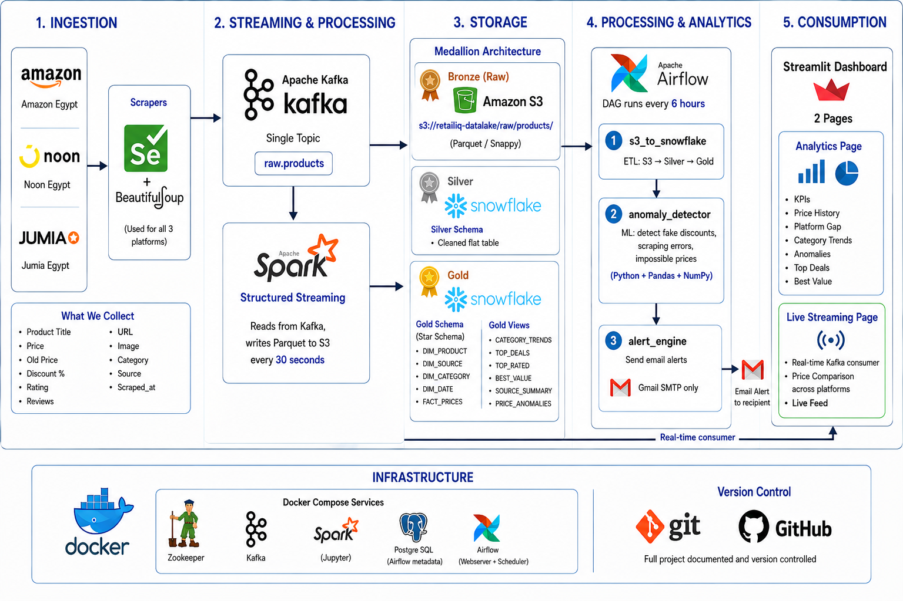
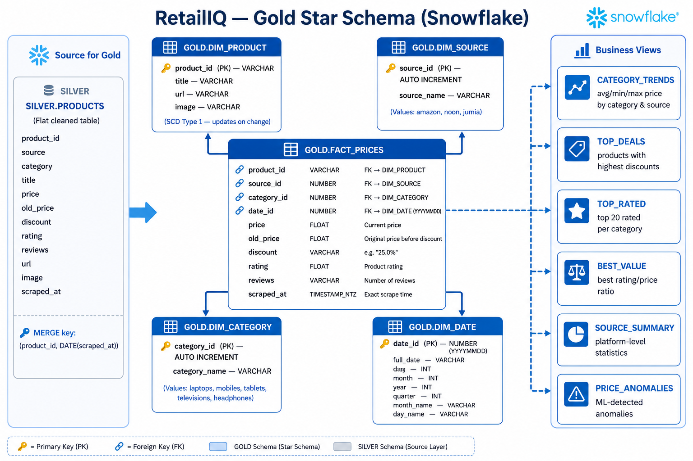
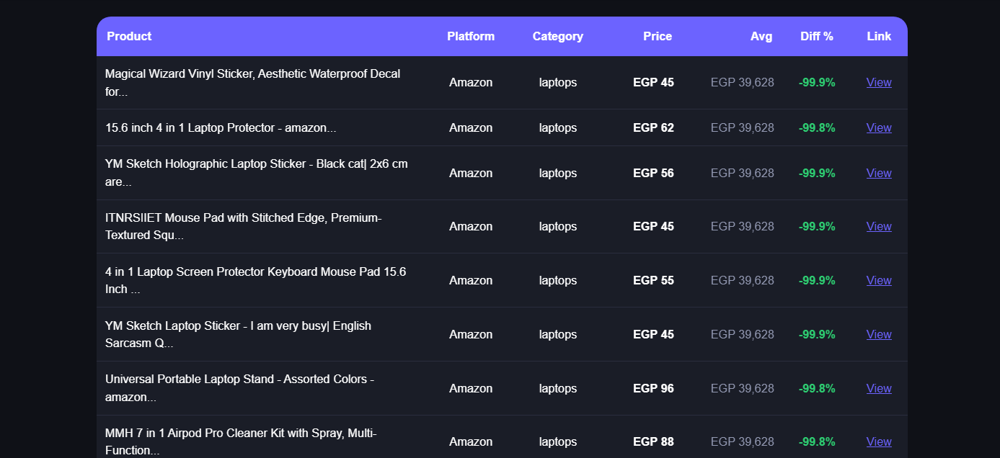

# 🛒 RetailIQ — Real-Time Retail Price Intelligence Platform

<div align="center">

**Automated price tracking & analytics across Egypt's top 3 e-commerce platforms**

[](https://python.org)
[](https://kafka.apache.org)
[](https://spark.apache.org)
[](https://snowflake.com)
[](https://airflow.apache.org)
[](https://streamlit.io)
[](https://docker.com)
[](https://aws.amazon.com/s3)

</div>

---

## 📌 Overview

**RetailIQ** is an end-to-end data engineering pipeline that automatically scrapes, processes, and analyzes product prices from **Amazon Egypt**, **Noon Egypt**, and **Jumia Egypt** in real-time.

The system continuously collects pricing data every 5 minutes across 5 product categories, processes it through a **Medallion Architecture** (Bronze → Silver → Gold), detects price anomalies using statistical analysis, and presents insights through an interactive Streamlit dashboard.

> 🎓 **ITI Data Engineering Track — Graduation Project 2026**

---

## 🏗️ Architecture



### Medallion Architecture

| Layer | Storage | Description |
|-------|---------|-------------|
| 🥉 **Bronze** | Amazon S3 | Raw Parquet files as-is from scrapers |
| 🥈 **Silver** | Snowflake | Cleaned, deduplicated flat table |
| 🥇 **Gold** | Snowflake | Star Schema + 6 analytical views |

---

## ✨ Features

- 🔄 **Real-time scraping** every 5 minutes across 3 platforms
- ⚡ **Live streaming dashboard** connected directly to Kafka
- 📊 **Historical price tracking** with day-over-day accumulation
- 🚨 **ML-based anomaly detection** (fake discounts, scraping errors, impossible prices)
- 📧 **Automated email alerts** for high-severity anomalies
- ⚖️ **Cross-platform price comparison** for the same product
- 🔁 **Fully automated pipeline** orchestrated by Apache Airflow

---

## 🛠️ Tech Stack

| Component | Technology | Purpose |
|-----------|-----------|---------|
| Scraping | Selenium + BeautifulSoup | Browser automation & HTML parsing |
| Messaging | Apache Kafka | Real-time message streaming |
| Processing | Apache Spark Structured Streaming | Kafka → S3 pipeline |
| Storage (Bronze) | Amazon S3 | Raw data lake (Parquet/Snappy) |
| Storage (Silver/Gold) | Snowflake | Data warehouse & analytics |
| Orchestration | Apache Airflow | Pipeline scheduling (every 6h) |
| Analytics | Pandas + NumPy | Data cleaning & anomaly detection |
| Dashboard | Streamlit + Plotly | Interactive analytics & live streaming |
| Infrastructure | Docker Compose | Containerized services |
| Version Control | Git / GitHub | Source code management |

---

## 📊 Data Schema



### Gold Star Schema

```
FACT_PRICES
├── product_id  → DIM_PRODUCT  (SCD Type 1)
├── source_id   → DIM_SOURCE   (amazon / noon / jumia)
├── category_id → DIM_CATEGORY (laptops / mobiles / tablets / televisions / headphones)
├── date_id     → DIM_DATE     (YYYYMMDD)
├── price, old_price, discount, rating, reviews, scraped_at
```

**MERGE Strategy:**
- Silver: `(product_id, DATE(scraped_at))` → price history accumulates daily
- Fact: `(product_id, source_id, date_id)` → no duplicates, full history preserved

---

## 📁 Project Structure

```
RetailIQ/
├── ingestion/
│   └── scrapers/
│       ├── amazon_scraper.py      # Selenium + BeautifulSoup
│       ├── noon_scraper.py        # Selenium (JS rendering)
│       └── jumia_scraper.py       # Requests + BeautifulSoup
├── streaming/
│   ├── kafka_producer.py          # Orchestrates scrapers → Kafka
│   └── spark_streaming.py         # Kafka → Parquet → S3
├── storage/
│   └── s3_to_snowflake.py         # Full ETL: S3 → Silver → Gold
├── ml/
│   └── anomaly_detector.py        # Statistical anomaly detection
├── alerting/
│   └── alert_engine.py            # Gmail SMTP email alerts
├── airflow/
│   └── dags/
│       └── retailiq_pipeline.py   # Airflow DAG (every 6h)
├── dashboard/
│   ├── app.py                     # Streamlit entry point
│   ├── snowflake_conn.py          # Cached Snowflake connection
│   └── pages/
│       ├── analytics.py           # Analytics page (Snowflake)
│       └── streaming.py           # Live streaming page (Kafka)
├── docker-compose.yml
├── requirements.txt
└── .env.example
```

---

## 🚀 Getting Started

### Prerequisites

- Docker & Docker Compose
- Python 3.11+
- AWS Account (S3 bucket)
- Snowflake Account
- Chrome browser (for Selenium)

### 1. Clone the repository

```bash
git clone https://github.com/your-username/RetailIQ.git
cd RetailIQ
```

### 2. Configure environment variables

```bash
cp .env.example .env
```

Edit `.env` with your credentials:

```env
AWS_ACCESS_KEY_ID=your_key
AWS_SECRET_ACCESS_KEY=your_secret
AWS_REGION=us-east-1
S3_BUCKET_NAME=retailiq-datalake

SNOWFLAKE_USER=your_user
SNOWFLAKE_PASSWORD=your_password
SNOWFLAKE_ACCOUNT=your_account
SNOWFLAKE_DATABASE=RETAILQ
SNOWFLAKE_WAREHOUSE=COMPUTE_WH

KAFKA_BOOTSTRAP_SERVERS=localhost:9092
```

### 3. Install Python dependencies

```bash
pip install -r requirements.txt
```

### 4. Start Docker services

```bash
docker-compose up -d
docker-compose ps   # verify all services are running
```

---

## ▶️ Running the Pipeline

### Step 1 — Start Spark Streaming (inside Docker)

```bash
docker exec -it <spark-container-name> bash
cd /home/jovyan/work
python streaming/spark_streaming.py
```

### Step 2 — Start Kafka Producer (locally)

```bash
python streaming/kafka_producer.py
```

> This scrapes Amazon, Noon & Jumia every 5 minutes and sends data to Kafka.

### Step 3 — Run ETL to Snowflake

```bash
python storage/s3_to_snowflake.py
```

### Step 4 — Run Anomaly Detection

```bash
python ml/anomaly_detector.py
```

### Step 5 — Launch Dashboard

```bash
streamlit run dashboard/app.py
```

Open: [http://localhost:8501](http://localhost:8501)

---

### Airflow (Automated Pipeline)

Access the Airflow UI at [http://localhost:8080](http://localhost:8080)

- **Username:** airflow
- **Password:** airflow

The `retailiq_pipeline` DAG runs automatically every 6 hours:

```
s3_to_snowflake → anomaly_detector → alert_engine
```

---

## 🧪 Anomaly Detection

Three types of anomalies are detected automatically:

| Type | Severity | Rule |
|------|----------|------|
| `SCRAPING_ERROR_PRICE_TOO_LOW` | 🔴 HIGH | Price < 5% of category median |
| `SUSPICIOUS_DISCOUNT_XX_PCT` | 🔴 HIGH / 🟡 MEDIUM | Discount > 70% |
| `OLD_PRICE_LESS_THAN_CURRENT` | 🟡 MEDIUM | old_price < price |

HIGH severity anomalies trigger an automated HTML email alert via Gmail SMTP.

---

## 📸 Dashboard Preview

### Analytics Page
> KPIs · Price History · Platform Gap · Category Trends · Anomalies · Top Deals · Best Value

### Live Streaming Page
> Real-time Kafka consumer · Platform Activity · Price Comparison · Live Feed



---

## 🗂️ Data Categories

| Category | Search Term |
|----------|-------------|
| 💻 Laptops | laptop |
| 📱 Mobiles | mobile |
| 📺 Televisions | tv |
| 📟 Tablets | tablet |
| 🎧 Headphones | headphones |

---

## 🤝 Contributing

1. Fork the repository
2. Create your feature branch (`git checkout -b feature/amazing-feature`)
3. Commit your changes (`git commit -m 'Add amazing feature'`)
4. Push to the branch (`git push origin feature/amazing-feature`)
5. Open a Pull Request

---

## 📄 License

This project is licensed under the MIT License.

---

<div align="center">

**Built with ❤️ by the RetailIQ Team — ITI Data Engineering Track 2026**

</div>
